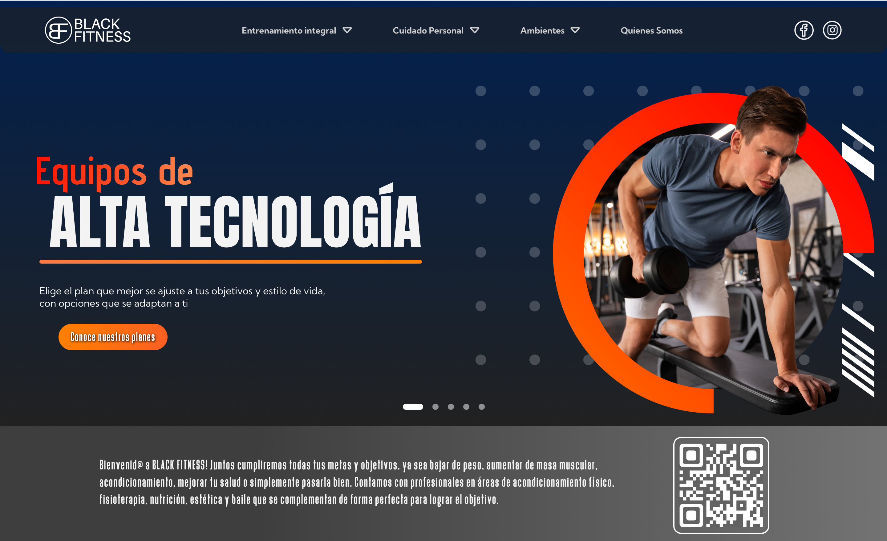
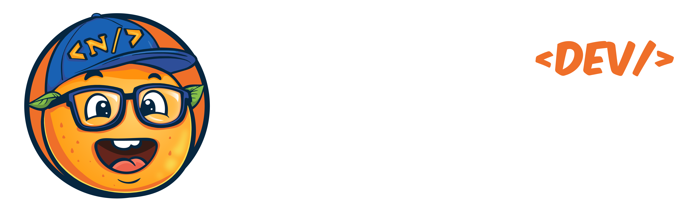

# Black Fitness

## Descripción del Proyecto

Este proyecto consiste en una landing page moderna y atractiva para Black Fitness, un gimnasio integral que ofrece servicios personalizados para ayudar a sus clientes a alcanzar sus metas 
de salud y acondicionamiento físico.

### Sobre Black Fitness

Black Fitness es más que un simple gimnasio. Es un centro de bienestar integral que se compromete a ayudar a sus clientes a lograr sus objetivos, ya sean:

- Pérdida de peso.
- Aumento de masa muscular.
- Mejora del acondicionamiento físico.
- Optimización de la salud general.
- Diversión y socialización.

El gimnasio cuenta con un equipo multidisciplinario de profesionales en:

- Acondicionamiento físico.
- Fisioterapia.
- Nutrición.
- Estética.
- Baile.

Esta combinación única de especialidades permite a Black Fitness ofrecer un enfoque holístico para el bienestar de sus clientes.

<div align="center">
    
</div>

---

## 🧩 Características

La landing page de Black Fitness está compuesta por las siguientes vistas:

- Página principal.
- Página de horarios de clase.
- Página de planes.
- Página de planes personalizados.
- Página de paquetes.
- Página de productos.
- Página de servicios complementarios.
- Página de quiénes somos.
- Enlace a redes sociales y whatsapp.

## 💻 Tecnologías

### 🎨 Diseño


### 🧑🏻‍💻 Desarrollo


### 🛠️ Herramientas


## 🗂️ Ejecutar el Proyecto Localmente

Clonar el Repositorio.

```
    git@github.com:Nisanech/black-fitness.git
```

Ingresar a la carpeta `black-fitness`.

```
    cd black-fitness
```

Crear una rama local con el nombre `develop`

```
    git checkout -b develop
```

```
     git pull origin develop
```

Instalar dependencias

```
     npm install
```

Crear el archivo `.env` para las diferentes variables de entorno utilizadas en el desarrollo, para esto puedes guiarte del archivo `.env.template`.

Iniciar el proyecto.

```
     npm run dev
```

## 🧑🏻‍💻 Desarrollado Por



## 📃 Licencia

[OrangeDev Licence](LICENCE)


